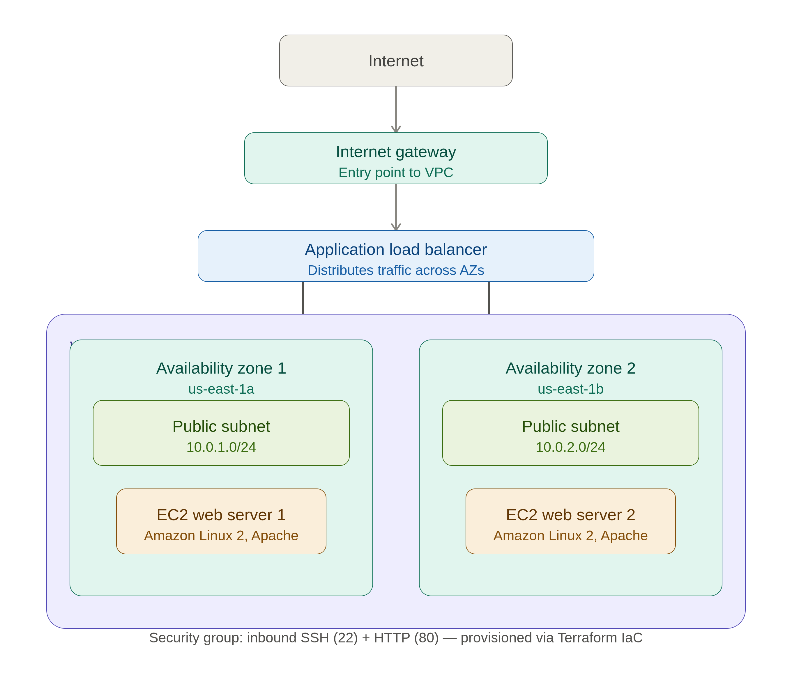

## 🏗️ Architecture

## 💡 Key Concepts Demonstrated

- **Remote-ready IaC** — Full infrastructure lifecycle managed via 
  `terraform init → plan → apply → destroy`
- **High Availability** — Multi-AZ deployment across 2 subnets ensures 
  no single point of failure
- **Load Balancing** — ALB distributes traffic across EC2 instances 
  with health checks
- **Security** — Security groups restrict access to SSH and HTTP only
- **Cost Conscious** — Resources destroyed after testing using 
  `terraform destroy` to avoid unnecessary AWS charges

## 📝 Note on AWS Account
Resources were deployed and validated on AWS, then destroyed using 
`terraform destroy` to avoid ongoing costs. 
The Terraform code is fully functional and can be redeployed 
on any AWS account using the steps below.
 ✅ Infrastructure tested and verified — resources destroyed after validation to avoid AWS charges.
